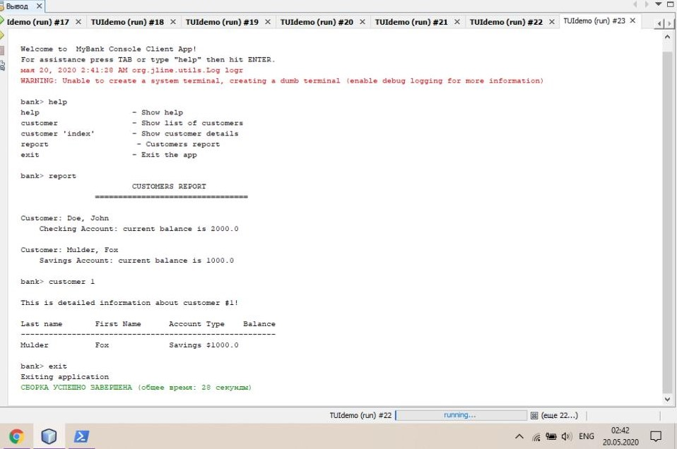

# UI Lab 2
## Опис виконання лабораторної роботи:
### Обране завдання - на п'ять:

* Завантажено jar-файли і підключено до створеного проекту з назвою TUIdemo.
* Підключено даний файл CLIdemo.java до проекту.
* Досліджено код цього файлу та впевнилась у його працездатності 
* Підключено метод для виводу звіту про клієнтів банку
* Запущено проект - все працює як очікувалось. 

## Результат

